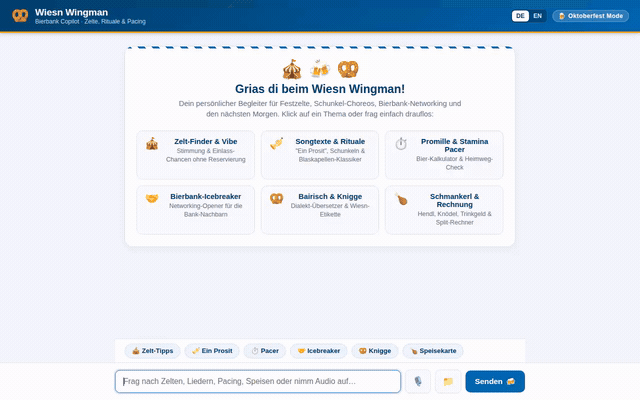

# 🥨 WiesnWingman (Bierbank Copilot)

> **A conversational Bavarian beer-bench wingman for Munich Oktoberfest attendees.**  
> Built with Google ADK, Agent Runtime, and Gemini on Google Cloud.



---

## 🎯 What WiesnWingman Does

WiesnWingman helps festival-goers and tech attendees navigate Oktoberfest beer tents, keep pace with high-gravity Bavarian Festbier, split bills smoothly, and remember table rituals.

### ✨ Implemented Capabilities & Tools

* **🧠 Cross-Session Long-Term Memory**:
  * Wired via **Vertex AI Memory Bank** (`PreloadMemoryTool` and `generate_memories_callback`).
  * Automatically stores and recalls user profile details, favorite Bavarian beers, preferred sing-along anthems, and transit routes across distinct sessions.

* **⛺ Oktoberfest Tent Directory & Etiquette (`app/firestore_tools.py`)**:
  * Backed by **Google Cloud Firestore**.
  * Query tent capacities, breweries, signature dishes, vibe, transit tips, and table standing rules (`list_oktoberfest_tents`, `get_oktoberfest_tent_details`, `add_or_update_oktoberfest_tent`, `list_wiesn_rules`, `get_wiesn_rule_detail`).

* **🍺 Stamina & BAC / Promille Pacer (`app/pacer_tools.py`)**:
  * Implements the scientific **Widmark Formula** to calculate estimated Blood Alcohol Content (BAC) and Bavarian Promille based on drinks consumed, gender, weight, and elapsed time (`calculate_drink_pacer_and_bac`).
  * Provides actionable water hydration ratios, food suggestions, and estimated time to full sobriety.

* **🎵 Song Whisperer & Anthems (`app/song_tools.py`)**:
  * Catalog of classic brass band sing-along anthems with German lyrics, English phonetic pronunciation guides, translations, and bench choreography (`identify_song_and_lyrics`, `list_popular_wiesn_anthems`).

* **🎙️ Live Audio Song Recognition (`app/song_tools.py`)**:
  * Multimodal audio recognition via `identify_song_from_audio`.
  * Accepts microphone audio (base64 string), direct URLs, local files, or Google Cloud Storage URIs (`gs://...`).
  * Analyzes brass instruments, percussion, and crowd singing using **Gemini 2.5 Flash** in the global region to identify anthems live in noisy beer tents.

* **🥨 Menu Catalog & Cash Tip Split (`app/menu_tools.py`)**:
  * Browse signature dishes across tents with dietary tags (vegetarian, vegan, gluten-free) and prices (`get_tent_food_menu`).
  * Calculates cash-friendly bill splitting with standard Bavarian Wiesn tip rounding (`calculate_bill_and_tip_split`).

* **🤝 Bierbank Icebreaker & Networking (`app/networking_tools.py`)**:
  * Generates bilingual Bavarian-English table conversation starters tailored to tech roles and beer-bench topics (`generate_bierbank_icebreaker`).

* **🏅 Commemorative Bierbank Badge & Postcard Generation (`app/image_gen_tools.py`)**:
  * Generates personalized vintage Bavarian art-nouveau commemorative badges using **Imagen** (`gemini-3.1-flash-lite-image`) via Vertex AI (`generate_bierbank_survivor_badge`).
  * Saves the image as a local ADK session artifact and uploads the image bytes directly to **Google Cloud Storage**, returning a publicly accessible URL.

* **🎴 Rich Display UI (A2UI v0.8)**:
  * Wired as an `after_model_callback` (`app/a2ui_utils.py`) with schema system prompt integration (`app/a2ui_instruction.py`).
  * Formats responses into cards, columns, typography hints, and image components.

* **🚦 Live Wiesn-Barometer & Tent Occupancy (`app/transit_tools.py`)**:
  * Real-time Oktoberfest crowd occupancy level checker (`check_tent_occupancy_barometer`).
  * Tracks door status, queue wait times, and alerts users immediately when tents are closed due to overcrowding (*Wegen Überfüllung geschlossen*).
  * Persists live telemetry state in Cloud Firestore (`live_wiesn_barometer` collection).

* **🚇 Smart Transit Bottleneck & Escape Routing (`app/transit_tools.py`)**:
  * Dynamically computes crowd-aware transit escape routes (`compute_live_transit_escape_route`).
  * Protects users from getting trapped in **Theresienwiese (U4/U5)** crowd bottlenecks and police gate closures (*Blockabfertigung*) by calculating walking escape paths to alternative stations (**Goetheplatz U3/U6**, **Schwanthalerhöhe U4/U5**, or **Hackerbrücke S-Bahn** trunk line).

---

## ☁️ Google Cloud Services Used

| Service | Component & Usage |
| :--- | :--- |
| **Agent Engine / Agent Runtime** | Hosting and executing the agent container over the A2A protocol (`google-adk`). |
| **Vertex AI Memory Bank** | Managed cross-session memory service storing user preferences. |
| **Cloud Firestore** | NoSQL database hosting tent directory, etiquette rules, and live barometer telemetry. |
| **Google Cloud Storage** | Storing and serving generated Bierbank Survivor badges and demo media. |
| **Gemini 2.5 Flash (Vertex AI)** | Multimodal reasoning, live audio recognition, and conversational orchestration. |
| **Gemini 3.1 Flash-Lite Image / Imagen** | Generating vintage commemorative Bierbank badges and survivor certificates. |

---

## 📋 Status of Planned vs. Implemented Features

* ✅ **Cross-session Memory Bank**: Implemented and verified.
* ✅ **Firestore Tent & Rules Catalog**: Implemented and verified.
* ✅ **Stamina / BAC Calculator**: Implemented and verified.
* ✅ **Song Whisperer & Audio Recognition**: Implemented and verified.
* ✅ **Menu & Tip Splitter**: Implemented and verified.
* ✅ **Imagen Badge Generation & Cloud Storage Upload**: Implemented and verified.
* ✅ **A2UI v0.8 Cards**: Implemented and verified.
* ✅ **Live Wiesn-Barometer & Tent Occupancy Alerts**: Implemented and verified.
* ✅ **Crowd-Aware Escape Routing (Goetheplatz / Hackerbrücke / Schwanthalerhöhe)**: Implemented and verified.
* ⏳ **Third-party MVG REST API token auth integration**: *Planned, not yet implemented* (transit intelligence currently runs autonomously using station hub heuristics and Firestore telemetry).

---

## 🛠️ Project Structure

```
wiesn-wingman/
├── app/
│   ├── agent.py                 # ADK root agent configuration, tools, and callbacks
│   ├── firestore_tools.py       # Firestore tent and festival rules catalog
│   ├── song_tools.py            # Sing-along songbook & live audio recognition
│   ├── pacer_tools.py           # BAC / Promille Widmark calculation & hydration pacer
│   ├── image_gen_tools.py       # Imagen badge generation & GCS upload
│   ├── networking_tools.py      # Bierbank icebreakers and Bavarian etiquette
│   ├── menu_tools.py            # Tent menus and cash tip splitting
│   ├── a2ui_instruction.py     # Static A2UI v0.8 schema system prompt
│   └── a2ui_utils.py            # A2UI after_model_callback data re-wrapper
├── frontend/
│   ├── main.py                  # FastAPI A2A proxy server
│   └── static/                  # Responsive web chat UI with A2UI card renderer & audio recorder
├── assets/
│   └── demo.gif                 # Looping demo recording
├── agents-cli-manifest.yaml     # Agents CLI project configuration
└── pyproject.toml               # Python project dependencies
```

---

## 🚀 Local Setup & Run Instructions

### Prerequisites
* Python 3.11+
* [uv](https://docs.astral.sh/uv/) package manager
* [Google Cloud CLI (`gcloud`)](https://cloud.google.com/sdk/docs/install) authenticated with Application Default Credentials:
  ```bash
  gcloud auth login
  gcloud auth application-default login
  ```

### 1. Install Dependencies
```bash
uv sync
```

### 2. Seed Firestore Data (Optional if already seeded)
```bash
uv run python -c "
from app.firestore_tools import seed_initial_wiesn_data
print(seed_initial_wiesn_data())
"
```

### 3. Run the Agent Locally (ADK Web Playground)
To run the local ADK developer playground with Memory Bank integration:
```bash
uv run adk web . --port 8080 --reload_agents --memory_service_uri=agentengine://<YOUR_AGENT_ENGINE_ID>
```

### 4. Run the Chat Frontend & A2A Proxy
To run the chat frontend connected to your deployed Agent Runtime instance:
```bash
cd frontend
export AGENT_ENGINE_RESOURCE_NAME="projects/<PROJECT_NUMBER>/locations/<REGION>/reasoningEngines/<ENGINE_ID>"
export AGENT_DIRECTORY="app"
python main.py
```
Open a browser to your configured local port (default `8080`).

---

## 🚢 Deployment

Deploy the agent to Google Cloud Agent Runtime using `agents-cli`:
```bash
agents-cli deploy --project <GCP_PROJECT_ID> --region us-central1 --service-name simple-agent
```
